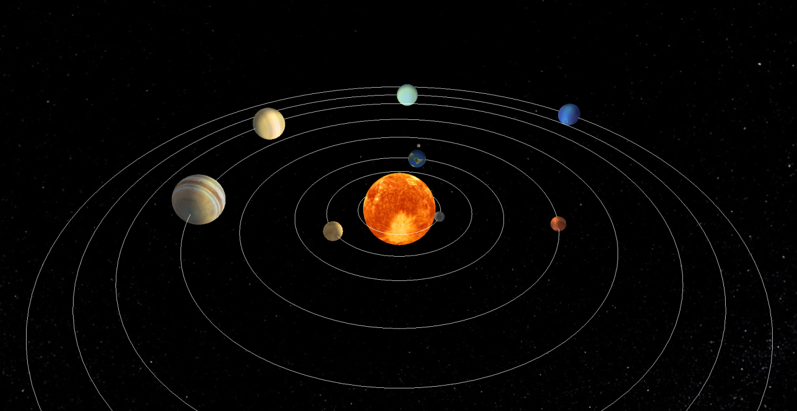
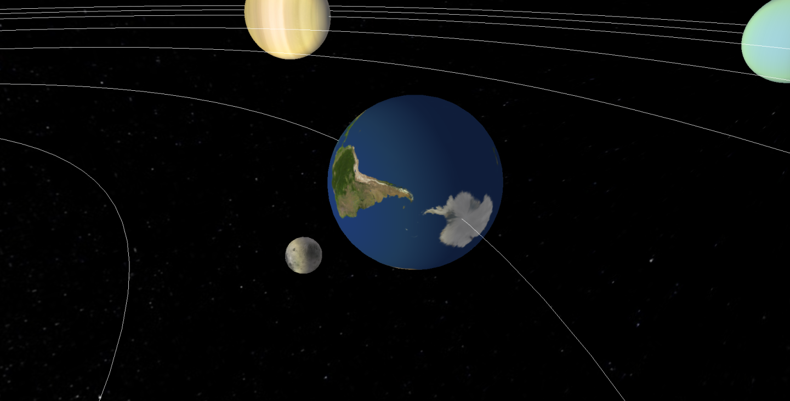

# ☀️ Projeto do Sistema Solar 🌎 — Introdução à Computação Gráfica

Este projeto é uma simulação do Sistema Solar em C++. O objetivo foi aprimorar os conhecimentos na Computação Gráfica, utilizando a biblioteca **OpenGL** para criar uma visualização interativa do Sistema Solar.

---

## 💻 O que o código faz?

- Representa visualmente a movimentação 3D do Sistema Solar.
- Permite que o usuário manipule a visão usando o teclado, permitindo ter um ponto de vista mais ampliado dos planetas.
- Pode usar usado para fins didáticos em aulas de Astronomia ou Computação Gráfica.

---

## 📸 Imagem do Programa

| Visão Geral                          | Visão da Terra e da Lua        |
|--------------------------------------|------------------------------------|
|        |      |

---

## ⚙️ Como compilar e executar

### ✅ Requisitos

- g++
- OpenGL
- stb_image.h

### 📦 Instalação

1. Clone o repositório:

```bash
git clone https://github.com/RivandoNeto/SolarSystem_OpenGL.git
cd SolarSystem_OpenGL
```


## 📦 Estrutura do Projeto

📁 projeto_sistema_solar/
├── sistema_solar.cpp </br>
├── stb_image.h </br>
├── textures/ </br>
│   └── background.jpg </br>
│   └── earth.jpg </br>
│   └── jupiter.jpg </br>
│   └── lua.jpg </br>
│   └── mars.jpg </br>
│   └── mercury.jpg </br>
│   └── neptune.jpg </br>
│   └── saturn.jpg </br>
│   └── sun.jpg </br>
│   └── uranus.jpg </br>
│   └── venus.jpg </br>
├── imgs/ </br>
│   ├── sistema_solar.png </br>
│   └── terra_lua.png </br>
├── README.md </br>


## 🎮 Controles
W, S, D – Movimentação da câmera
J, K, L, I – Movimentação da visão
C, space – Movimentação para cima ou para baixo

ESC – Sair do programa

## 🧠 Principais Conceitos Envolvidos
Uso de colisões

Fundamentos de movimentação

Conceitos de iluminação

Manipulação de texturas


### Como Rodar o Código

- Para compilar e rodar o código, abra o terminal no diretório em que clonou o repositório e use o seguinte comando:
```bash
g++ sistema_solar.cpp -o sistema_solar -lGL -lGLU -lglut && ./sistema_solar
```

## 🛠 Principais problemas encontrados
Sombreamento geral.

Rotação e translação da Lua.

Iluminação dos planetas.

## 🚀 Melhorias possíveis
Implementação do eclipse.

Adição dos anéis de Saturno.

Sombras ou sombreamento por distância para maior realismo.

## 👥 Equipe


| Integrante                           | Tarefa                             |
|--------------------------------------|------------------------------------|
| Allis Marques                        | Implementação de iluminação e colisão|
| Rivando Neto                         | Implementação de textura e movimento|

## 👨‍💻 Autores
Desenvolvido por Allis Marques e Rivando Neto  </br>
Projeto acadêmico para a disciplina de Introdução à Computação Gráfica
